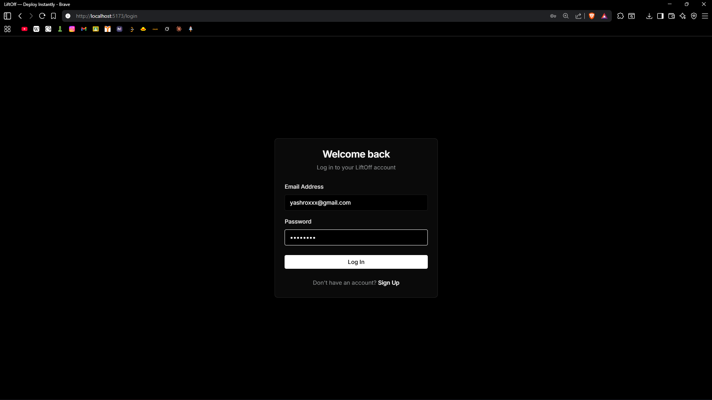
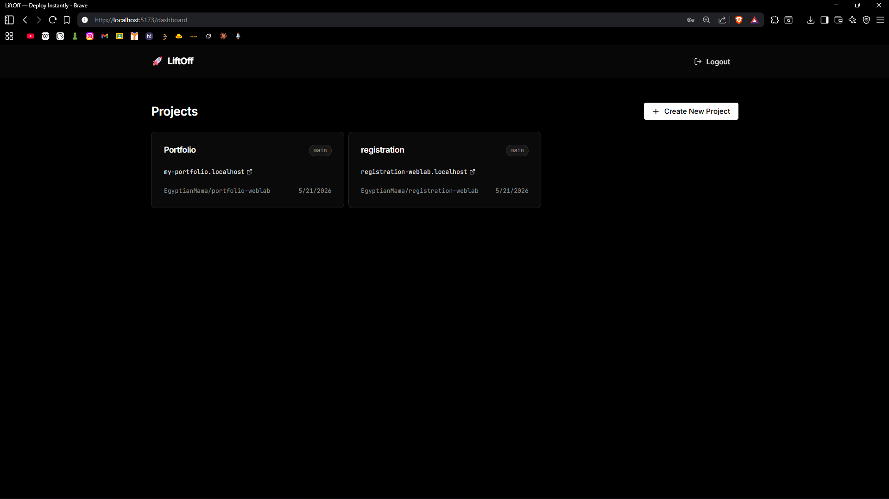
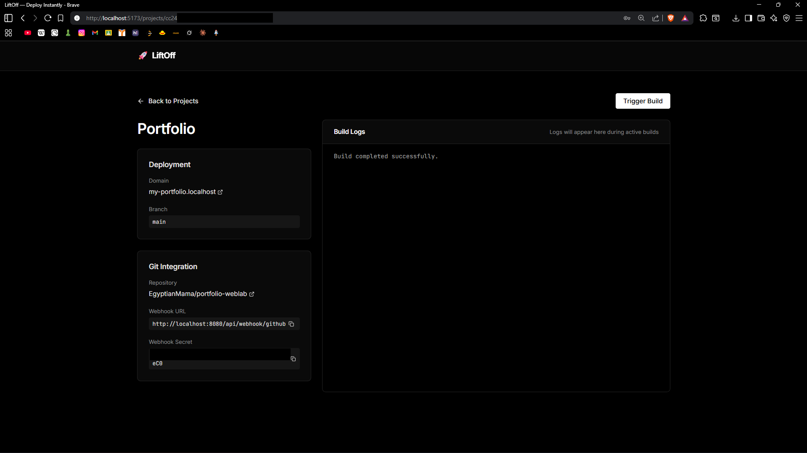
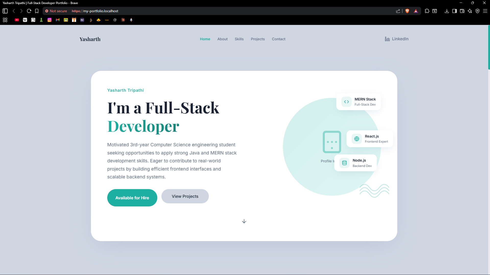

# 🚀 LiftOff

**Self-hosted Serverless Deployment Platform** — push to GitHub, get a live site with HTTPS on a custom subdomain in seconds.

LiftOff is a complete Vercel/Netlify clone built from scratch. It is designed to demonstrate an end-to-end automated deployment pipeline: from receiving a webhook, cloning code, building it inside isolated Docker containers, to serving the artifacts over a dynamically configured Caddy reverse proxy. 

| | |
|:---:|:---:|
|  <br>  |  <br> 
|  <br>  |  <br> 

---

## 🏗️ Architecture & Infrastructure

LiftOff is composed of three main layers that work in tandem to deploy your applications:

### 1. The React Frontend
A sleek, modern single-page application built with React, Vite, and Tailwind-inspired custom CSS. It provides:
- **Authentication**: JWT-based user login and registration.
- **Dashboard**: View all your projects, recent builds, and deployment statuses.
- **Project Detail**: Trigger builds manually and watch real-time server-sent events (SSE) logs streaming directly from the backend during a build.

### 2. The Spring Boot Backend
The core orchestrator written in Java 21 and Spring Boot 3.4.5. It manages:
- **Webhooks & REST APIs**: Exposes endpoints for the frontend and GitHub Webhooks.
- **Build Engine**: Communicates with the Docker daemon via `docker-java` to spawn ephemeral containers that clone repositories, detect frameworks (like Static HTML or Node.js), and build the artifacts safely.
- **Log Streaming**: Captures `stdout` and `stderr` from the Docker build containers and streams them to the frontend using Server-Sent Events (`SseEmitter`).
- **Data Persistence**: Uses PostgreSQL to track Users, Projects, and Build histories.

### 3. The Reverse Proxy (Caddy)
The dynamic traffic router. LiftOff integrates deeply with Caddy's Administration API:
- Upon a successful build, the backend pushes a new JSON configuration to Caddy's REST API (`localhost:2019/config/`).
- Caddy instantly registers the new subdomain (e.g., `my-project.localhost` or your production domain).
- Caddy automatically provisions and renews Let's Encrypt / ZeroSSL TLS certificates (or local certificates for dev) for secure HTTPS connections.

---

## 🛠️ Technology Stack

| Layer | Technology |
|-------|-----------|
| **Frontend** | React, TypeScript, Vite, React Router DOM |
| **Backend Core** | Java 21 (LTS), Spring Boot 3.4.5, Spring Security, JWT (JJWT) |
| **Database** | PostgreSQL 16, Hibernate / JPA, Flyway Migrations |
| **Containerization** | Docker Engine API (`docker-java`) |
| **Reverse Proxy** | Caddy Server (configured dynamically via API) |

---

## ⚙️ Features

- 🔒 **Secure Authentication**: End-to-end JWT security protecting your projects.
- 📦 **Dockerized Builds**: Every build runs in an isolated, ephemeral Docker container ensuring your host machine stays clean.
- 🔄 **Real-Time Streaming**: Watch your builds execute in real-time on the frontend via SSE.
- 🔀 **Dynamic Routing**: Add new projects without restarting the server. Caddy handles the hot-reloading of subdomains automatically.
- 🐙 **GitHub Integration**: Add a webhook to your repo, and LiftOff will build and deploy on every `git push`.
- 🔍 **Framework Detection**: Automatically detects Static HTML and applies the correct build steps.

---

## 🚀 Getting Started

### Prerequisites
- Java 21+ and Maven 3.9+
- Node.js 18+ (for frontend development)
- Docker & Docker Compose (Make sure Docker Desktop is running)
- *Optional:* A registered GitHub App / Webhook secret for push integrations.

### 1. Start the Infrastructure (Database & Reverse Proxy)
LiftOff relies on PostgreSQL and Caddy. We've bundled them into a Docker Compose file.
```bash
docker-compose -f docker-compose.dev.yml up -d
